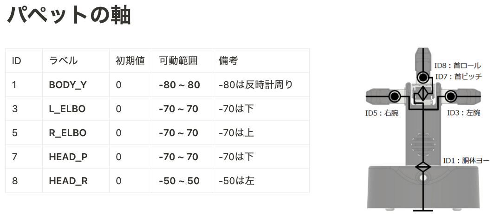

# 機器構成

    ◇ puppet本体（RaspberryPi）
        - ロボット動作用のjarファイルを実行

    ◇ puppet中継用PC（OSフリー）
        - ChromeからCAPF（ブラウザ）のページを開く
        - CAPFに CA（アバター）としてログイン
        - CAPFから受け取ったコマンドをpuppet本体に中継
        - コマンド中継用のpythonスクリプトを実行
        - 必要に応じて オーディオ / カメラモジュール を接続

    ◇ operator用PC（OSフリー）
        - ChromeからCAPFのページを開く
        - CAPF に OP（オペレータ）として接続
        - CAPF越しに中継PCに対してコマンドを送信
        - スクリプト等は起動させる必要はない
        - 必要に応じて オーディオ / カメラモジュール を接続

 

# puppet 本体の環境構築

[robo-tutorial](https://github.com/social-robotics-lab/robo-tutorial/wiki/%E3%83%AD%E3%83%9C%E3%83%83%E3%83%88%E3%81%AE%E7%92%B0%E5%A2%83%E6%A7%8B%E7%AF%89) の **Raspberry Pi 版パペットの場合** を参照

 

# puppet 中継用 PC 内の環境構築

## Python 3.10 のインストール

### windows の場合

- [公式サイト](https://www.python.org/downloads/)からダウンロード＆インストール
- インストール時「Add Python 3.10 to PATH」にチェックを入れること

### macOS の場合

- 以下のコマンドをターミナルから実行
- brew install python@3.10

 

## Python モジュールのインストール

- このリポジトリ（puppet_fest ディレクトリ）内で以下を実行
- pip install -r requirements.txt

 

# Puppet の操作方法

## ◇ puppet 内での操作

- puppet を起動し、ssh 等でリモートログイン後以下のコマンドを実行
- cd RobotController_bin
- sudo java -jar RobotController.jar

 

## ◇ puppet 中継用 PC 内での操作

- Chrome を開き、[CAPF](https://hanazono.ca-platform.org/) にアクセス
- CA001 としてログイン
- launch_webagent.sh の内容をみて、対象となる puppet の IP アドレスに変更
- ./launch_webagent.sh を実行
    
  ＊ 中継するコマンドは webagent.py に記述 

 

## ◇ operator 用 PC 内での操作

- Chrome を開き、[CAPF](https://hanazono.ca-platform.org/) にアクセス
- OP001 としてログイン
- ログイン後、対象となる CA の映像を選択してからコマンドを入力して puppet の動作を確認

 

## 参考： Puppet の持つサーボ軸

 

 
